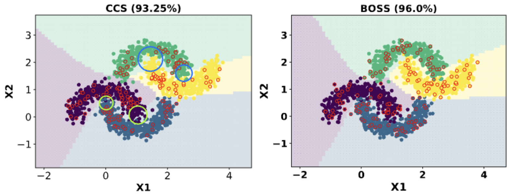

Implementation of the paper:
### Balancing Feature Similarity and Label Variability for Optimal Size-Aware One-shot Subset Selection
https://icml.cc/virtual/2024/poster/34221



initial training: 
```
python train.py --dataset tiny-imagenet-200 --gpuid 0 --epochs 100 --lr 0.1 --network resnet34 --batch-size 256 --task-name all-data-tiny --base-dir ./model/tiny --initial_train 1
```

importance score:
```
python generate_importance_score.py --gpuid 0 --base-dir ./model/tiny --task-name all-data --data-dir ../data --dataset tiny-imagenet-200
```

Subset Train:
```
python train.py --dataset tiny-imagenet-200 --gpuid 0 --epochs 100 --network resnet34 --task-name boss_test --base-dir ./model/tiny --coreset --coreset-mode boss --data-score-path ./model/tiny/all-data/data-score-all-data.pickle --coreset-key el2n_total --coreset-ratio 0.1 --mis-ratio 0.1 --c_param 2 --a_param 2
```


Our source code is based on 


https://github.com/haizhongzheng/Coverage-centric-coreset-selection


https://github.com/SJShin-AI/LCMat
